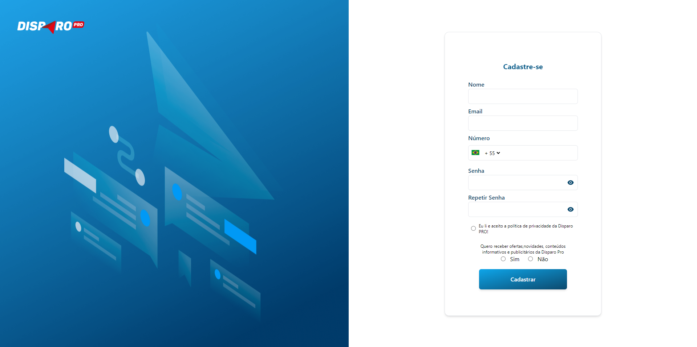

Este é um projeto em [Next.js](https://nextjs.org/) com gerenciador de pacotes Yarn.

## Brasilfone Teste FrontEnd

Rodar a versão em modo de Desenvolvimento:

```bash
yarn dev
```

Abrir [http://localhost:3000](http://localhost:3000) Em seu navegador.


Abrir [http://localhost:3000/login](http://localhost:3000/login) Em seu navegador.


Abrir [http://localhost:3000/register](http://localhost:3000/register) Em seu navegador.



Abrir [http://localhost:3000/reset](http://localhost:3000/reset) Em seu navegador.


